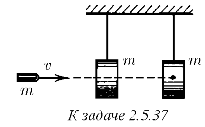
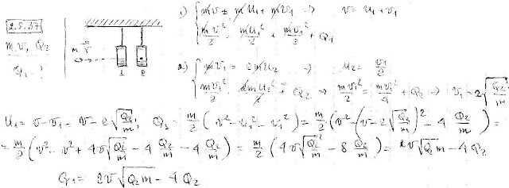
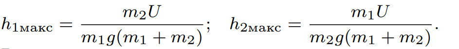

###  Условие: 

$2.5.37.$ Пуля массы $m$, имеющая начальную скорость $v$, пробивает подвешенный на нити груз той же массы $m$ и застревает во втором таком же. Найдите выделившееся в первом грузе количество теплоты, если во втором грузе выделилось количество теплоты $Q_2$. Временем взаимодействия пули с грузом пренебречь. 

 

###  Решение: 

 

###  Ответ: 

 
