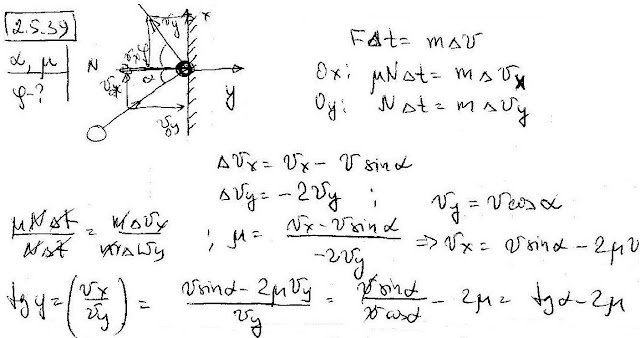

###  Условие: 

$2.5.39.$ Тело налетает на неподвижную стенку под углом $\alpha$ к нормали. Коэффициент трения о стенку $\mu$. Под каким углом тело отлетит от этой стенки? 

###  Решение: 

 

####  Ответ: $\tan\beta = \tan\alpha − 2\mu$ при $\tan\alpha > 2\mu ;$ в противном случае $\beta = 0$ 
