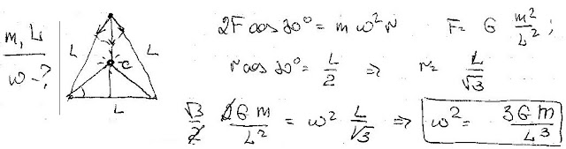

###  Условие:

$2.6.16.$ Три звезды массы $m$ каждая сохраняют в своем движении конфигурацию равностороннего треугольника со стороной $L$. С какой угловой скоростью вращается этот треугольник?

###  Решение:

#### Ответ: $\omega^2 = 3\gamma m/l^3$