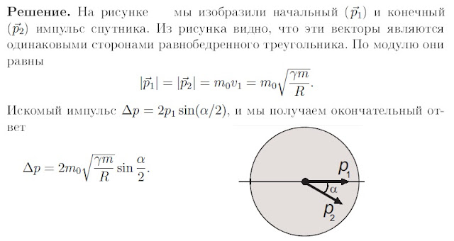

###  Условие: 

$2.6.18.$ Спутник массы $m_0$ движется по круговой орбите радиуса $R$ вокруг планеты массы $m$. Какой импульс нужно мгновенно сообщить спутнику, чтобы плоскость его орбиты повернулась на угол $\alpha$, а радиус не изменился? 

###  Решение: 

 

###  Ответ: $p = 2m_0\sqrt{\gamma m/R} \,\sin\frac{\alpha}{2}$ 
