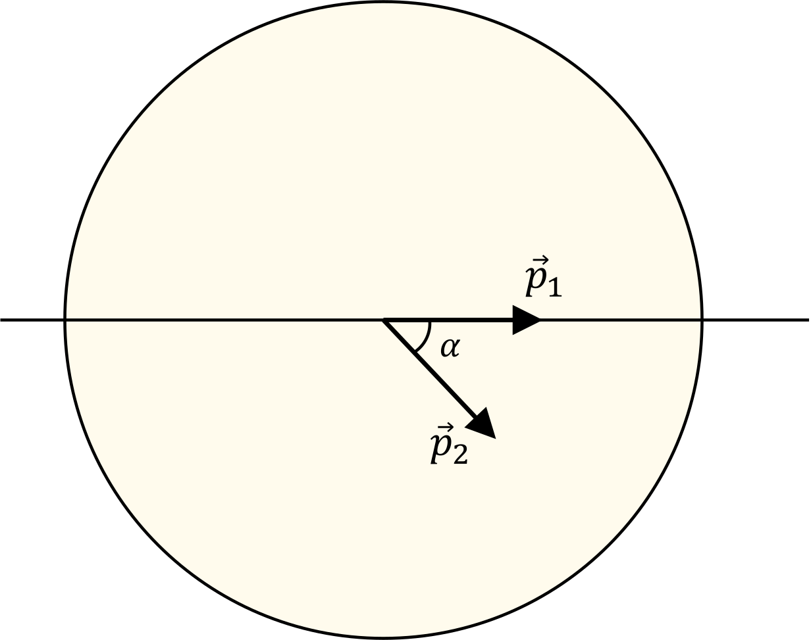

###  Условие:

$2.6.18.$ Спутник массы $m_0$ движется по круговой орбите радиуса $R$ вокруг планеты массы $m$. Какой импульс нужно мгновенно сообщить спутнику, чтобы плоскость его орбиты повернулась на угол $\alpha$, а радиус не изменился?

###  Решение:

На рисунке мы изобразили начальный $\vec{p}_1$ и конечный $\vec{p}_2$ импульсы частицы. Из рисунка видно, что эти векторы являются одинаковыми сторонами равнобедренного треугольника. По модулю они равны

\[
|\vec{p}_1| = |\vec{p}_2| = m_0 v_1 = m_0 v = m_0 \sqrt{\frac{m}{R}}.
\]

Искомый импульс

\[
\Delta p = 2 p_1 \sin \left(\frac{\alpha}{2} \right),
\]

и мы получаем окончательный ответ

\[
\Delta p = 2 m_0 \sqrt{\frac{m}{R}} \sin \left(\frac{\alpha}{2} \right).
\]

###  Ответ: $p = 2m_0\sqrt{\gamma m/R} \,\sin\frac{\alpha}{2}$