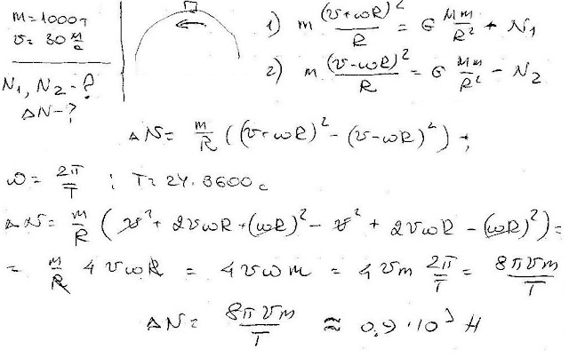

###  Условие:

$2.6.20.$ Два одинаковых поезда массы $1000 \,т$ каждый движутся по экватору навстречу друг другу со скоростями $30 \, м/с$. На сколько отличаются силы, с которыми они давят на рельсы?

###  Решение:

#### Ответ: $\Delta N \approx 9 \cdot 10^3 \,Н$