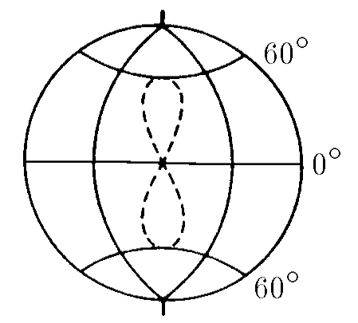

###  Условие: 

$2.6.21.$ а. Каков радиус орбиты спутника, лежащей в экваториальной плоскости, если тот все время находится в зените над одной и той же точкой земной поверхности? 
б. Опишите качественно трассу спутника, если при том же радиусе орбиты ее плоскость образует угол $60^{\circ}$ с плоскостью экватора. (Трассой спутника называется линия, соединяющая точки на Земле, из которых спутник виден в зените.) 

###  Решение: 

Уравнение движения спутника из условия равновесия центростремительной силы и силы гравитации:

$$
\frac{mv^2}{R} = G \frac{mM}{R^2}
$$

Упрощаем

$$
v^2 = G \frac{M}{R}
$$

Выражая орбитальную скорость $v$ через угловую скорость $\omega = \frac{2\pi}{T}$ и радиус орбиты $R$, получаем:

$$
\frac{4\pi R^2}{T^2} = G \frac{M}{R}
$$

Отсюда выражаем радиус орбиты $R$:

$$
R^3 = \frac{GMT^2}{4\pi^2}\Rightarrow R= \sqrt[3]{\frac{GMT^2}{4\pi^2}} \approx42\cdot10^{3} \mathrm{~км.}
$$

###  Ответ: 

а. $R\approx42\cdot10^{3} \mathrm{~км.}$

б. «Восьмерка», «касающаяся» 60-х параллелей с точкой пересечения на экваторе