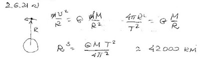
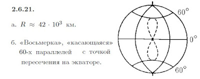

###  Условие: 

$2.6.21.$ а. Каков радиус орбиты спутника, лежащей в экваториальной плоскости, если тот все время находится в зените над одной и той же точкой земной поверхности? б. Опишите качественно трассу спутника, если при том же радиусе орбиты ее плоскость образует угол $60^{\circ}$ с плоскостью экватора. (Трассой спутника называется линия, соединяющая точки на Земле, из которых спутник виден в зените.) 

###  Решение: 

 

###  Ответ: 

 
