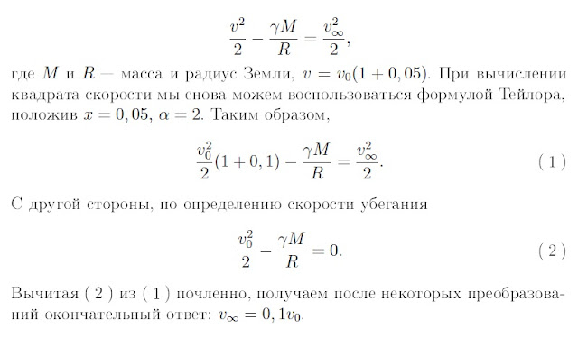

###  Условие: 

$2.6.25.$ На поверхности планеты телу сообщили скорость, превышающую вторую космическую скорость на $0.5\%.$ Во сколько раз скорость тела вдали от планеты будет меньше второй космической скорости? 

###  Решение: 

 

###  Ответ: В $10$ раз меньше. 
