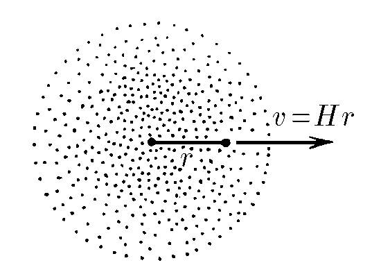
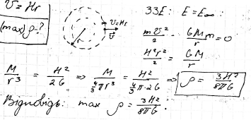

###  Условие: 

$2.6.29.$ Скорость пылинок однородного шарового облака направлена радиально и пропорциональна расстоянию до центра: $v = Hr$; это относится к начальному моменту. При какой наибольшей начальной плотности облако будет неограниченно расширяться? (Для тела внутри однородной сферической оболочки суммарная гравитационная сила со стороны оболочки нулевая.) 

###  Решение: 

 

####  Ответ: $\rho_{макс} = 3H^2/(8\pi\gamma )$ 
