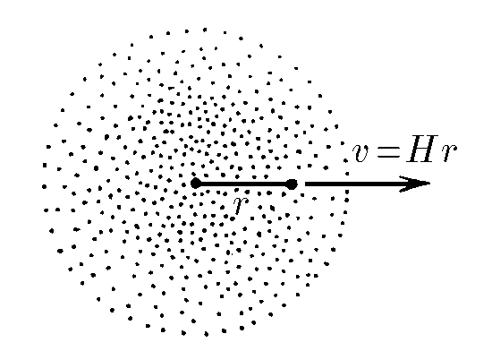

###  Условие:

$2.6.29.$ Скорость пылинок однородного шарового облака направлена радиально и пропорциональна расстоянию до центра: $v = Hr$; это относится к начальному моменту. При какой наибольшей начальной плотности облако будет неограниченно расширяться? (Для тела внутри однородной сферической оболочки суммарная гравитационная сила со стороны оболочки нулевая.)

###  Решение:

Рассмотрим оболочку радиуса $r$, которая будет иметь суммарную нулевую энергию что означает что оболочка будет расширяться бесконечно.

$$\frac{mv^2}{2}-\frac{GMm}{r}=0.$$

$$M=\frac{H^2r^3}{2G}.$$

Масса это произведения плотности оболочки на обьем.

$$M= \frac{4 \pi r^3}{3} \hspace{0.1cm} \rho.$$

$$\rho=\frac{3H^2}{8 \pi G}.$$

Так как плотность не зависит от радиуса оболочки, начальная плотность постоянна для любого момента времени.

$$\rho_0=\rho$$

#### Ответ:  

$$\rho_0=\frac{3H^2}{8 \pi G}$$ 