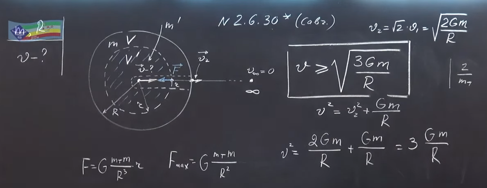

###  Условие:

$2.6.30^*.$ Какую скорость нужно сообщить телу небольшой массы в центре астероида массы $m$ и радиуса $R$, чтобы оно через радиальную шахту ушло от астероида бесконечно далеко? Астероид можно считать однородным.

###  Решение:

####  Ответ: $v = \sqrt {3\gamma m/R}$