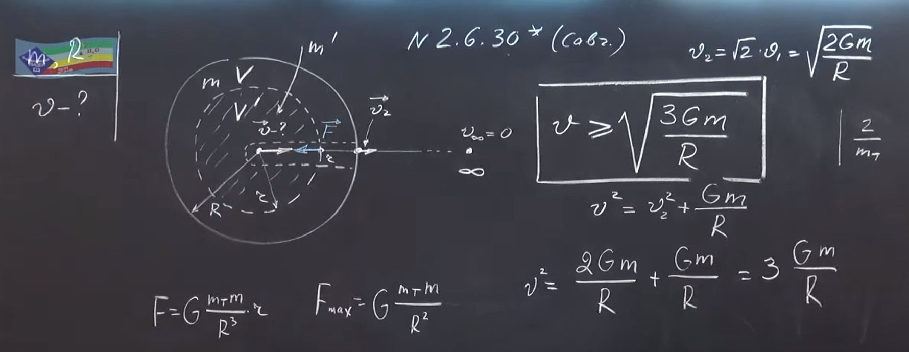

###  Условие:

$2.6.30^*.$ Какую скорость нужно сообщить телу небольшой массы в центре астероида массы $m$ и радиуса $R$, чтобы оно через радиальную шахту ушло от астероида бесконечно далеко? Астероид можно считать однородным.

###  Решение:

#### Ответ: $v = \\sqrt {3\\gamma m/R}$

