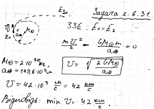

###  Условие:

$2.6.31.$ Космический аппарат вдалеке от Земли находится на том же расстоянии от Солнца, что и Земля. При какой минимальной его скорости он покинет Солнечную систему?

###  Решение:

###  Ответ: $v \approx 42 \,км/с.$