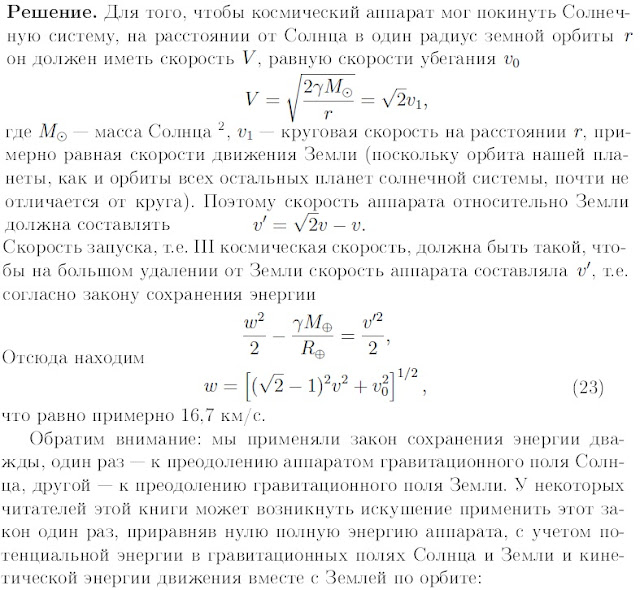
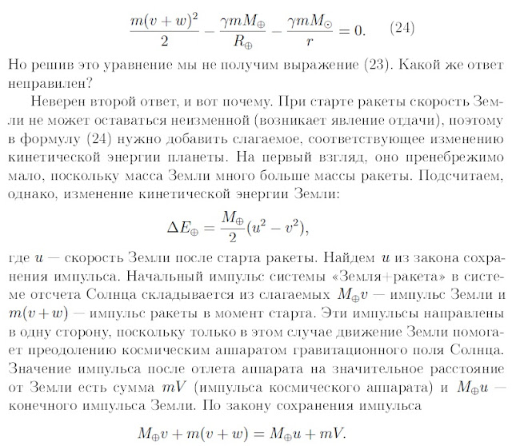
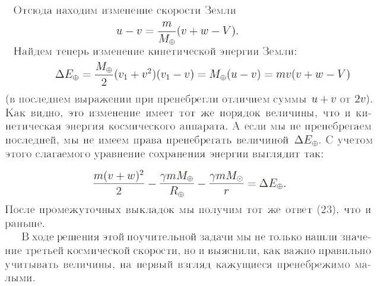

###  Условие: 

$2.6.32^*.$ Наименьшая скорость тела на поверхности Земли, обеспечивающая его выход за пределы Солнечной системы, называется третьей космической скоростью. Найдите ее, если известно, что скорость орбитального движения Земли $30 \,км/с$. 

###  Решение: 

 

 

 

###  Ответ: $v \approx 16.7 \,км/с$ 
