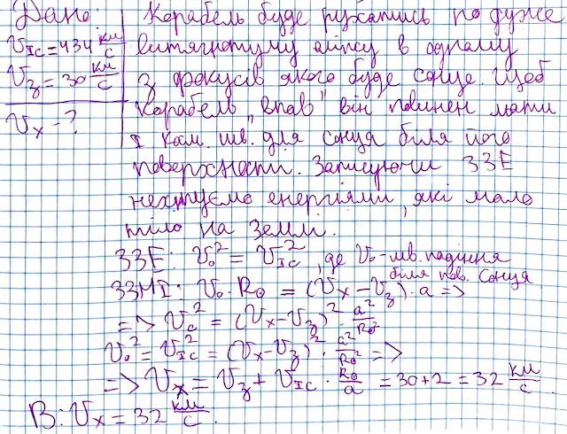

###  Условие: 

$2.6.33^*.$ В фантастическом рассказе описывается, как из-за небольшой ошибки в выборе начальной скорости при старте с поверхности Земли межпланетный корабль падает на Солнце. При какой наименьшей скорости на поверхности Земли это возможно? 

###  Решение: 

 

###  Ответ: $v_{мин} = 29 \,км/с$ 
