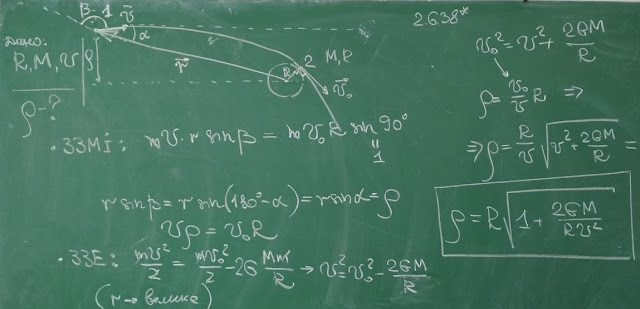

###  Условие:

$2.6.38^*.$ К планете радиуса $R$ и массы $M$ издалека движется со скоростью $v$ относительно нее космический зонд. При каком прицельном параметре $\rho$ зонд пролетит ближе всего к планете, не разбившись?

###  Решение:

#### Ответ: $ \rho = R\sqrt{1 + 2\gamma M/(Rv^2)}$