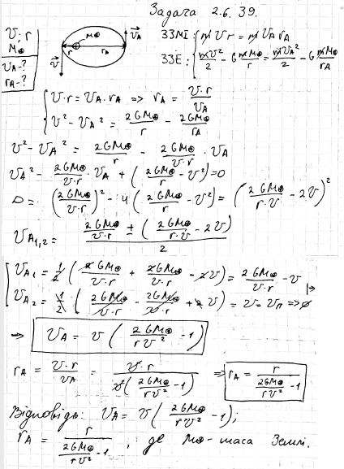

###  Условие:

$2.6.39^*.$ Скорость спутника в перигее равна $v$ при расстоянии до центра Земли, равном $r$. Какова скорость спутника в апогее? Каково расстояние от него до центра Земли в апогее?

###  Решение:

#### Ответ: $V = v(\frac{2\gamma M}{rv^2}− 1);$ $R = \frac{r}{2\gamma M/rv^2} − 1,$ $M$ — масса Земли