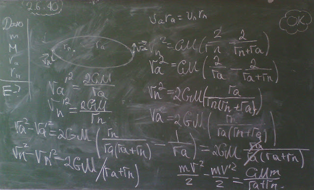

###  Условие:

$2.6.40^*.$ Космический зонд массы $m$ движется вокруг планеты массы $M$ по орбите с наибольшим удалением $r_а$ от центра планеты (в апоцентре) и наименьшим — $r_п$ (в перицентре). Какую минимальную энергию нужно сообщить зонду, чтобы он покинул планету?

###  Решение:

###  Ответ: $E = \gamma Mm/(r_а + r_п)$