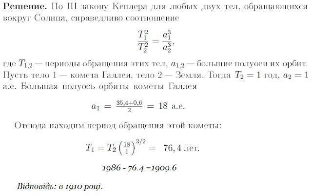

###  Условие: 

$2.6.47.$ Наибольшее расстояние от Солнца до кометы Галлея составляет $35.4$ радиуса земной орбиты, а наименьшее — $0.6$. Прохождение ее вблизи Солнца наблюдалось в $1986$ году; в каком году произошло ее предыдущее прохождение? 

###  Решение: 

 

Симуляция орбиты кометы Галлея   
  

 

###  Ответ: В 1910 г. 
