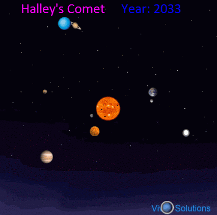

###  Условие: 

$2.6.47.$ Наибольшее расстояние от Солнца до кометы Галлея составляет $35.4$ радиуса земной орбиты, а наименьшее — $0.6$. Прохождение ее вблизи Солнца наблюдалось в $1986$ году; в каком году произошло ее предыдущее прохождение? 

###  Решение: 

 

По III закону Кеплера для любых двух тел, обращающихся вокруг Солнца, справедливо соотношение:

\[
\frac{T_1^2}{T_2^2} = \frac{a_1^3}{a_2^3},
\]

где \(T_1, T_2\) — периоды обращения этих тел, \(a_1, a_2\) — большие полуоси их орбит. Пусть тело 1 — комета Галлея, тело 2 — Земля. Тогда \(T_2 = 1\) год, \(a_2 = 1\) а. е. Большая полуось орбиты кометы Галлея:

\[
a_1 = \frac{35.4 + 0.6}{2} = 18 ~ \text{а.е.}
\]

Отсюда находим период обращения этой кометы:

\[
T_1 = T_2 \left( \frac{a_1}{a_2} \right)^{3/2} = 76.4 ~ \text{лет.}
\]

Год в котором произошло предыдущее прохождение кометы Галлея

$$
1986 - 76.4 = 1909.6.
$$

####  Ответ: В 1910 г. 
