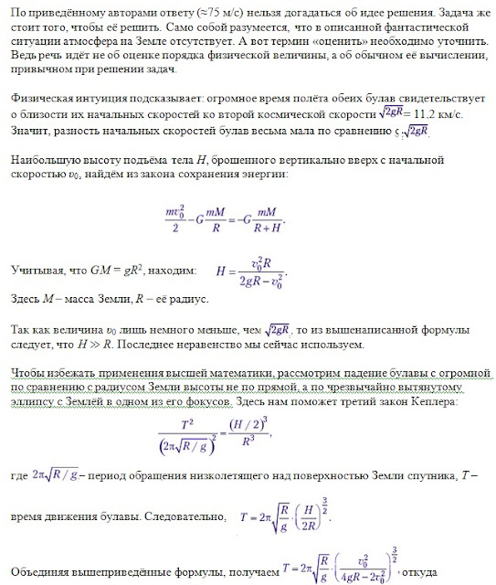
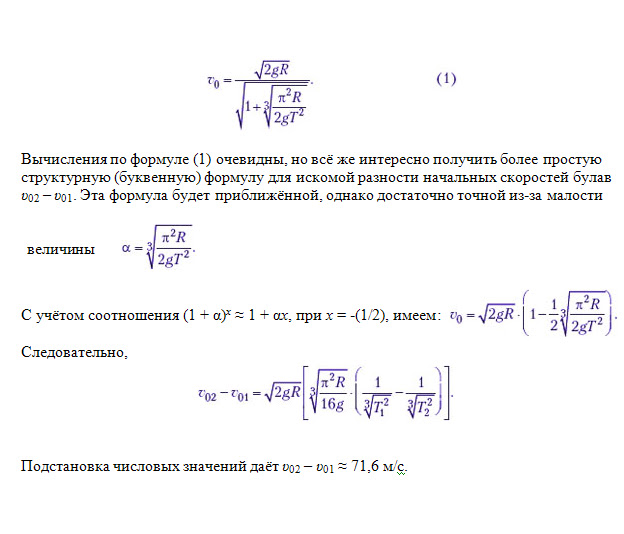

###  Условие: 

$2.6.50^*.$ Два богатыря на полюсе Земли бросают вертикально вверх булавы. Первая упала через неделю, вторая — через $30$ дней. Оцените, на сколько различались их начальные скорости. 

###  Решение: 

 

 

###  Ответ: $\Delta v \approx 70 \,м/с$ 
