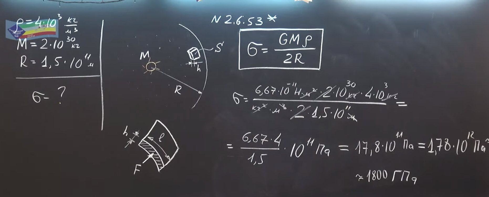

###  Условие: 

$2.6.53^*.$ Известный физик Ф. Дайсон высказал предположение, что можно было бы полностью использовать энергию звезд, если бы космические цивилизации могли окружить звезды сферическими оболочками. Найдите напряжение в материале неподвижной однородной оболочки, которая окружила бы в соответствии с этим предположением Солнце, при ее радиусе, равном радиусу земной орбиты. Плотность материала оболочки $\rho =4 \cdot 10^3 \mathrm{~кг} / \mathrm{м}^3$. 

###  Решение: 

 

 

###  Ответ: $\sigma\approx 1,8 \cdot 10^{12}$ Па. 

### 
