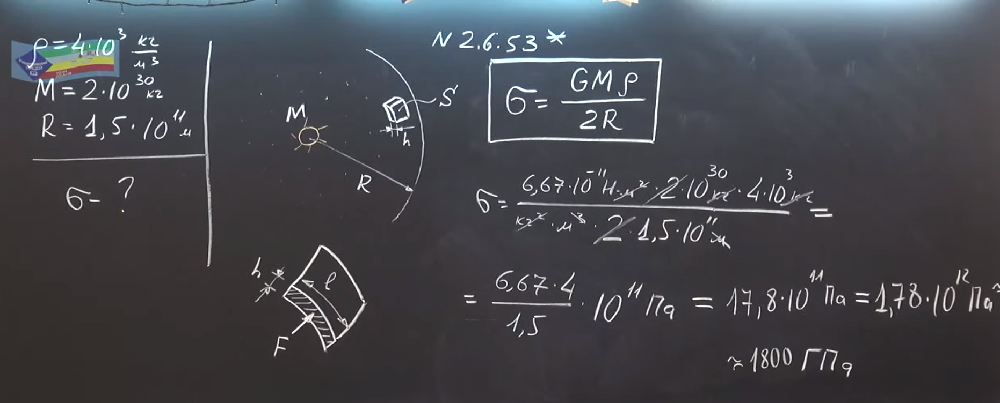

###  Условие:

$2.6.53^*.$ Известный физик Ф. Дайсон высказал предположение, что можно было бы полностью использовать энергию звезд, если бы космические цивилизации могли окружить звезды сферическими оболочками. Найдите напряжение в материале неподвижной однородной оболочки, которая окружила бы в соответствии с этим предположением Солнце, при ее радиусе, равном радиусу земной орбиты. Плотность материала оболочки $\\rho =4 \\cdot 10^3 \\mathrm{~кг} / \\mathrm{м}^3$.

###  Решение:

### Альтернативное решение

Силу, действующую на малую площадь сферы, можно выразить как произведение механического напряжения на эту площадь:

$$
\\mathrm{d}F = \\sigma\\, \\mathrm{d}S
$$

Из стереометрии известно, что площадь полной сферы:

$$
S = 4\\pi R^2 = R^2 \\Omega,
$$

где \\( \\Omega = 4\\pi \\) — телесный угол полной сферы.

Берём дифференциал площади при постоянном \\( \\Omega \\):

$$
\\mathrm{d}S = 2R\\, \\mathrm{d}R\\, \\Omega
$$

Отсюда получаем:

$$
\\mathrm{d}R = \\frac{\\mathrm{d}S}{2R\\Omega}
$$

Сила на малую часть сферы определяется как:

$$
\\mathrm{d}F = g\\, \\mathrm{d}m
$$

Согласно теореме Гаусса, поток гравитационного поля:

$$
\\oint g\\, \\mathrm{d}S = -4\\pi G M
$$

Из симметрии поля:

$$
g \\cdot 4\\pi R^2 = -4\\pi G M \\quad \\Rightarrow \\quad g = -\\frac{G M}{R^2}
$$

(Знак минус означает, что поле направлено к центру.)

Масса малого объема:

$$
\\mathrm{d}m = \\rho\\, \\mathrm{d}V
$$

Дифференциал объема через радиус и площадь:

$$
\\mathrm{d}V = 4\\pi R^2\\, \\mathrm{d}R = \\frac{R\\, \\mathrm{d}S}{2}
$$

Подставим всё в исходное уравнение:

$$
\\sigma\\, \\mathrm{d}S = \\left( \\frac{G M}{R^2} \\right) \\rho \\left( \\frac{R\\, \\mathrm{d}S}{2} \\right)
$$

Сокращаем \\( \\mathrm{d}S \\) и упрощаем:

$$
\\sigma = \\frac{G M \\rho}{2R}
$$

Подставляя значения, получаем:

$$
\\boxed{\\sigma = 1{,}8 \\cdot 10^{12}\\ \\text{Па}}
$$

#### Ответ: $\\sigma\\approx 1,8 \\cdot 10^{12}$ Па.

