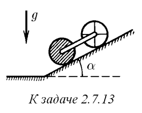
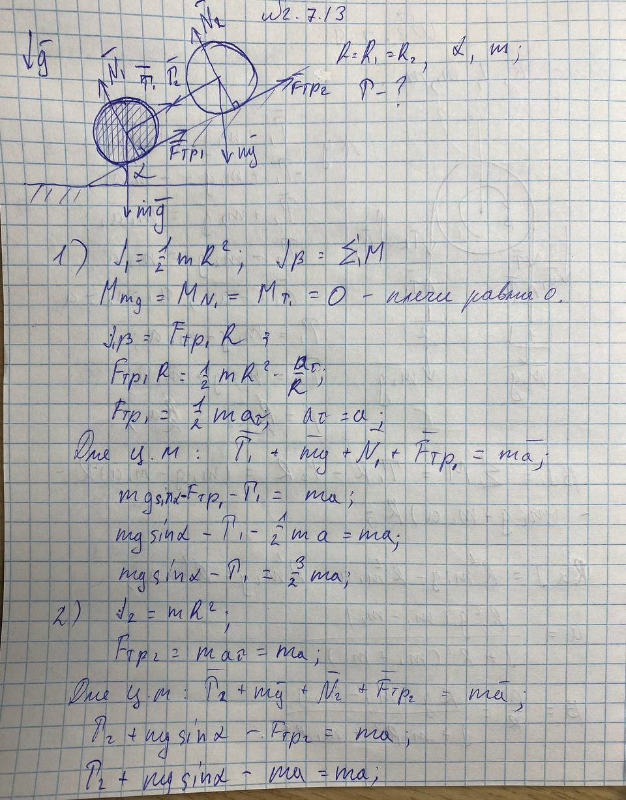
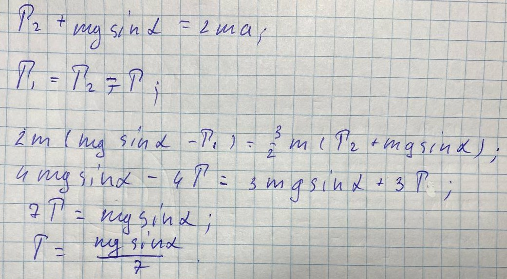

###  Условие: 

$2.7.13^*.$ Оси тонкостенного и сплошного цилиндров соединены невесомой штангой. Цилиндры скатываются без проскальзывания по наклонной плоскости с углом $\alpha$. Радиусы цилиндров одинаковы, масса каждого цилиндра $m$. Определите силу натяжения штанги. 

 

###  Решение: 

 

 

###  Ответ: $T = \frac{mg \, \sin\alpha}{7}$ 
