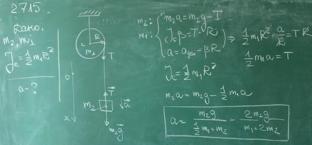

###  Условие: 

$2.7.15.$ Сплошной цилиндр массы $m_1$ насажен на горизонтальную ось. На цилиндр намотан шнур, к свободному концу которого подвешена гиря массы $m_2$. С каким ускорением станет опускаться гиря, если ее отпустить? 

###  Решение: 

 

###  Ответ: $a = 2m_2g/(2m_2 + m_1)$ 
