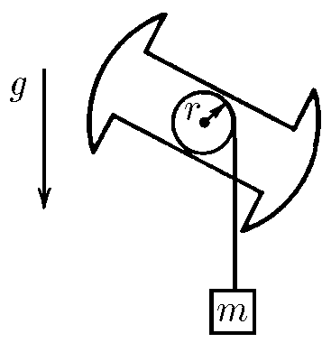
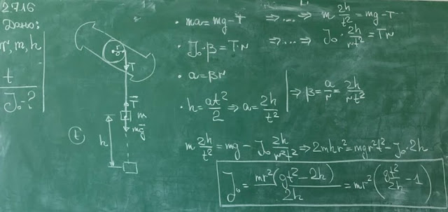

###  Условие: 

$2.7.16.$ Скорость пылинок однородного шарового облака направлена радиально и пропорциональна расстоянию до центра: $v = Hr$; это относится к начальному моменту. При какой наибольшей начальной плотности облако будет неограниченно расширяться? (Для тела внутри однородной сферической оболочки суммарная гравитационная сила со стороны оболочки нулевая.) 

###  Решение: 

 

####  Ответ: $J = mr^2[gt^2/(2h) − 1]$ 
