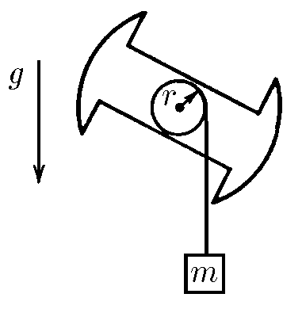
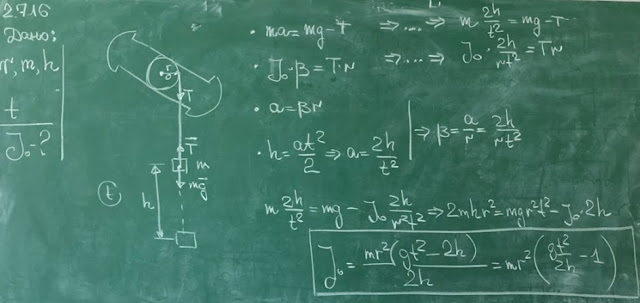

###  Условие:

$2.7.16.$ Твердое тело насажено на горизонтальную ось, проходящую через его
центр масс. На ту же ось насажен легкий блок радиуса r, жестко прикрепленный
к телу. К свободному концу нити, намотанной на блок, подвешена гиря массы m.
Гирю отпускают. Через время t она опускается на расстояние h. Найдите момент
инерции тела.

###  Решение:

#### Ответ: $J = mr^2[gt^2/(2h) − 1]$
Ответ: Да