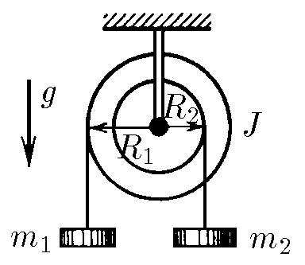

###  Условие: 

$2.7.17.$ На ступенчатый цилиндрический блок намотаны в противоположных направлениях две нити с подвешенными к ним грузами массы $m_1$ и $m_2$. Найдите ускорение грузов и силу натяжения нитей. Момент инерции блока $J$, радиус соответствующих участков блока $R_1$ и $R_2$. 

###  Решение: 

 

###  Ответ: 

$$
a_1 =g\frac{(m_1R_1-m_2R_2)R_1}{J+mR_1^2+m_2R_2^2},\quad a_2=-g\frac{(m_1R_1-m_2R_2)R_2}{J+m_1R_1^2+m_2R_2^2};
$$

$$
T_1 =m_1g\frac{J+m_2R_2(R_2+R_1)}{J+m_1R_1^2+m_2R_2^2},\quad T_2=m_2g\frac{J+m_1R_1(R_2+R_1)}{J+m_1R_1^2+m_2R_2^2}
$$