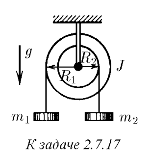
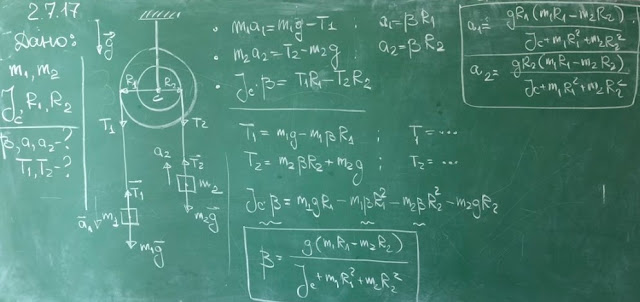
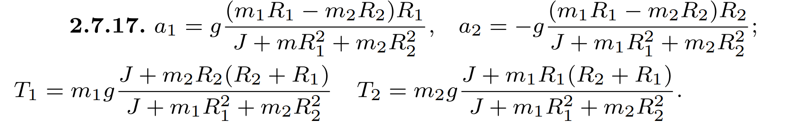

###  Условие: 

$2.7.17.$ На ступенчатый цилиндрический блок намотаны в противоположных направлениях две нити с подвешенными к ним грузами массы $m_1$ и $m_2$. Найдите ускорение грузов и силу натяжения нитей. Момент инерции блока $J$, радиус соответствующих участков блока $R_1$ и $R_2$. 

 

###  Решение: 

 

###  Ответ: 

 
