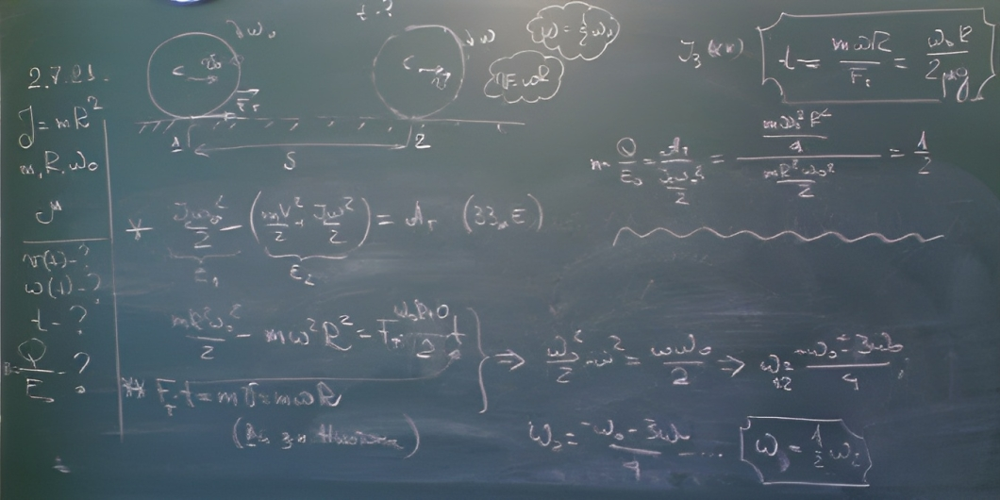
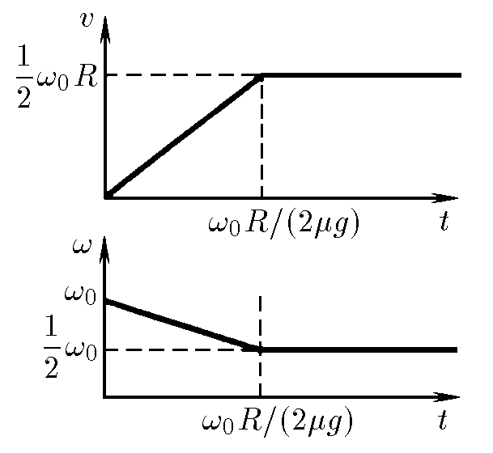

###  Условие:

$2.7.21^*.$ Тонкое кольцо радиуса $R$ и массы $m$ раскрутили до угловой скорости $\omega_0$ и поставили вертикально на горизонтальную плоскость. Как будет двигаться кольцо, если коэффициент трения кольца о плоскость равен $\mu$? Определите зависимость от времени скорости оси и угловой скорости вращения. Через какое время прекратится проскальзывание? Какая часть начальной энергии перейдет в тепло?

###  Решение:

####  Ответ: См. рис. $t = \omega_0R/(2\mu g);$ $Q/E = 1/2$

