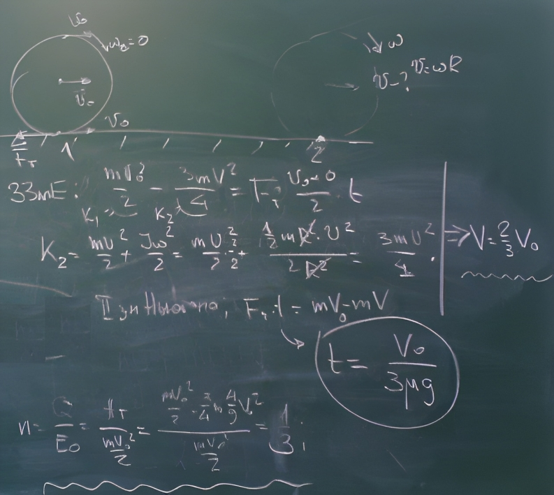

###  Условие:

$2.7.22^*.$ Однородный цилиндр радиуса $R$ и массы $m$ толкнули с начальной скоростью $v_0$ без вращения вдоль горизонтальной плоскости. Через какое время прекратится проскальзывание, если коэффициент трения цилиндра о плоскость равен $\mu$? Какая часть начальной энергии перейдет в тепло?

###  Решение:

###  Ответ: $t = v_0(3\mu g);$ $Q/E = 1/3$