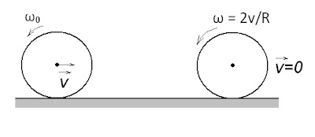

###  Условие:

$2.7.24.$ Ознакомьтесь с условиями задачи [2.4.18.](/ru/2.4.18) При какой начальной угловой скорости обруч радиуса $R$ вернется в исходную точку, двигаясь с постоянным ускорением по горизонтальному полу? На чальная скорость центра обруча $v$.

###  Решение:

Поскольку обруч возвращается в начальное место - место старта, то его конечная скорость равна начальной:
$$
v_к=v_н-v
$$

Согласно второму закону Ньютона для вращательного движения:

$$
M=I\beta
$$

Подставляем значения для момента силы трения $(F_\text{fr} = \mu mg)$ и момент инерции тонкого обруча $(J = mR^2)$:

$$
μmgR = mR^2(\omega_0 – \omega )/t
$$

Упростим уравнение, сократив на $m$:

$$
μgt = R(\omega_0 – \omega)
$$

Так как обруч вернётся в исходное положение, конечная угловая скорость $\omega = 2v/R$, поэтому:

$$
μgt = R(\omega_0 – 2v/R) \tag{1}
$$

Согласно второму закону Ньютона для поступательного движения:

$$
F_т = ma
$$

Подставим силу трения $F_\text{fr}$ и ускорение $a=v/t$:

$$
μmg = mv/t
$$

Упростим:

$$
μgt = v \tag{2}
$$

Из уравнения $(2)$ выражаем $t$ и подставляем в уравнение $(1)$:

$$
\omega_0 = 3v/R
$$

а искомое условие будет иметь вид

$$
\omega_0 \geq 3v/R
$$

#### Ответ: $\omega\geq 3v/R$