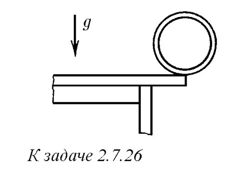
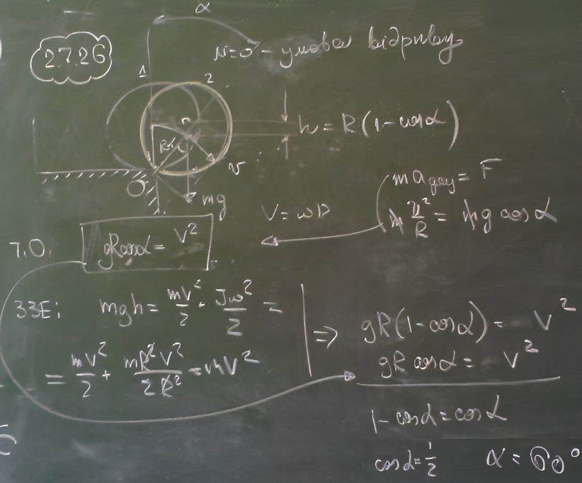
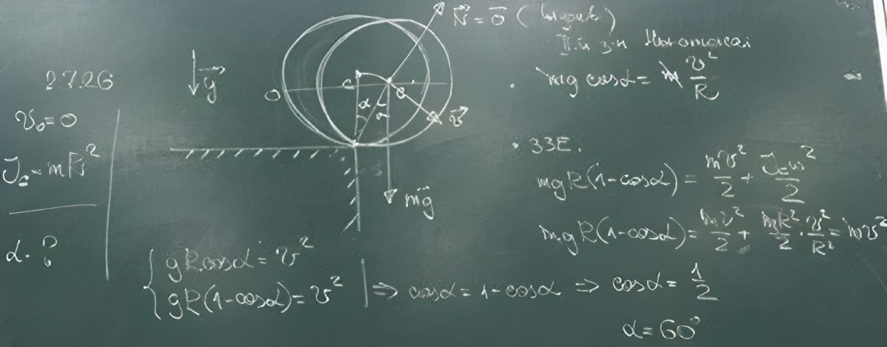

###  Условие:

$2.7.26.$ Центр тонкого кольца находится как раз над краем стола. Кольцо начинает скатываться со стола без проскальзывания из состояния покоя. На какой угол повернется кольцо до момента отрыва его от края стола? Больше или меньше будет этот угол в случае, если со стола скатывается шар?

###  Решение:

###  Альтернативное решение:

###  Ответ: $\alpha = 60^{\circ}.$ Меньше