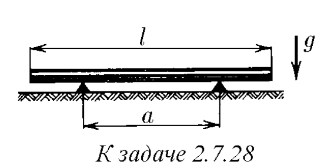
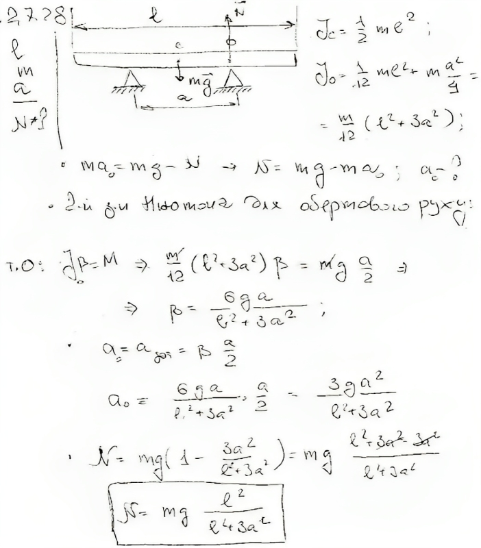

###  Условие:

$2.7.28^*.$ Тонкая однородная палочка длины $l$ и массы $m$ лежит симметрично на опорах, расстояние между которыми равно $a$. Одну из опор быстро убирают. Какова сразу после этого сила реакции оставшейся опоры?

###  Решение:

###  Ответ: $N = mgl^2/(l^2 + 3a^2)$