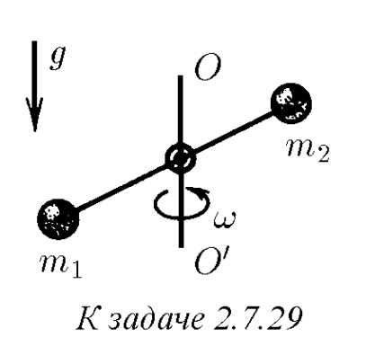
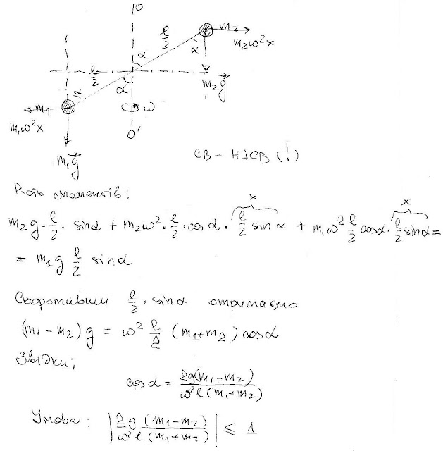
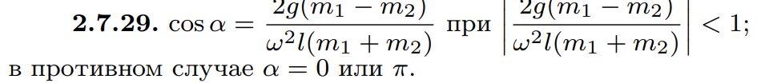

###  Условие:

$2.7.29.$ Гантель с шариками массы $m_1$ и $m_2$, соединенными невесомым стержнем длины $l$, вращается вокруг вертикальной оси, проходящей через центр гантели, с угловой скоростью $\omega$. Определите угол, который образует ось гантели с осью вращения.

###  Решение:

#### Ответ:

