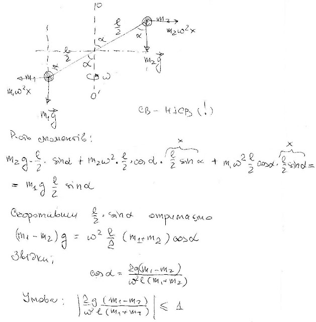

###  Условие:

$2.7.29.$ Гантель с шариками массы $m_1$ и $m_2$, соединенными невесомым стержнем длины $l$, вращается вокруг вертикальной оси, проходящей через центр гантели, с угловой скоростью $\omega$. Определите угол, который образует ось гантели с осью вращения.

###  Решение:

#### Ответ:

\(
\cos \alpha = \frac{2g(m_1 - m_2)}{\omega^2 l (m_1 + m_2)} \quad \text{при} \quad \left| \frac{2g(m_1 - m_2)}{\omega^2 l (m_1 + m_2)} \right| < 1; 
\)

\(
\text{в противном случае } \alpha = 0 \text{ или } \pi.
\)