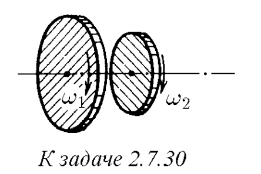
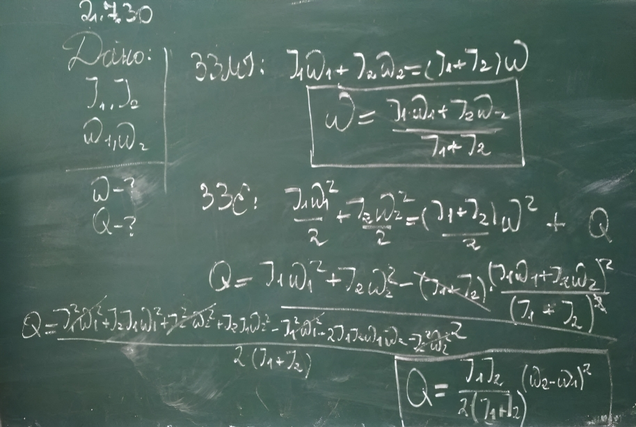
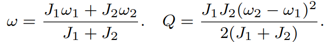

###  Условие:

$2.7.30.$ Два диска с моментами инерции $J_1$ и $J_2$ вращаются с угловой скоростью соответственно $\omega_1$ и $\omega_2$ вокруг одной и той же оси без трения. Диски пришли в соприкосновение друг с другом. Из-за возникшего между дисками трения через некоторое время проскальзывание одного диска по другому прекращается. Какова станет тогда угловая скорость вращения дисков? Какое количество теплоты выделится?

###  Решение:

#### Ответ:

