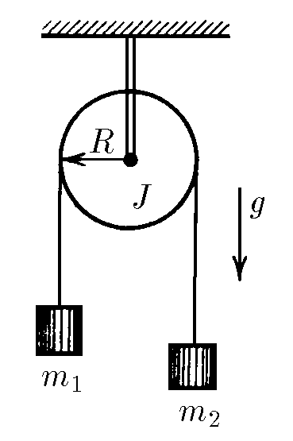
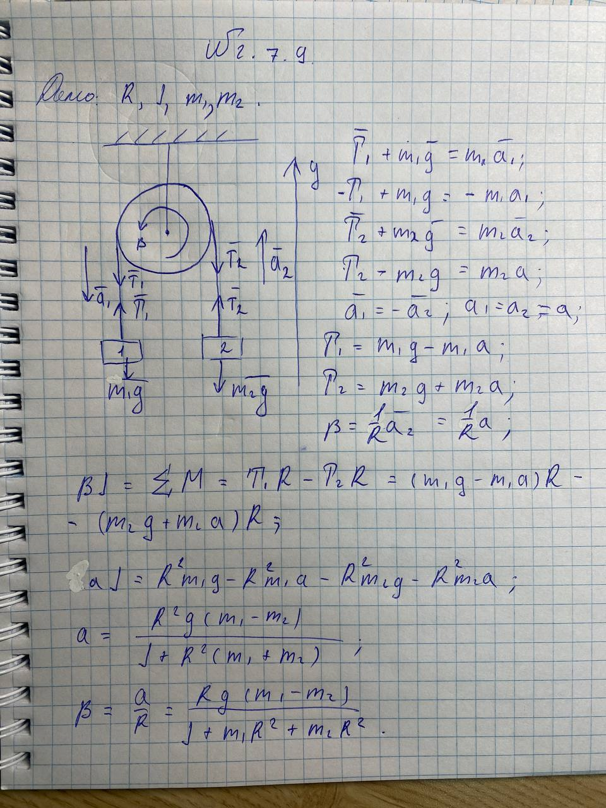

###  Условие: 

$2.7.9^*.$ Определите угловое ускорение блока радиуса $R$ с моментом инерции $J$, вызванное двумя грузами массы $m_1$ и $m_2$, закрепленными на концах нити, перекинутой через блок, если нить не проскальзывает по блоку. 

###  Решение: 

 

####  Ответ: 

$$
w = |m_1 − m_2|gR/(J + m_1 R^2 + m_2 R^2)
$$ 
