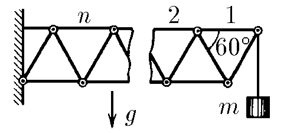
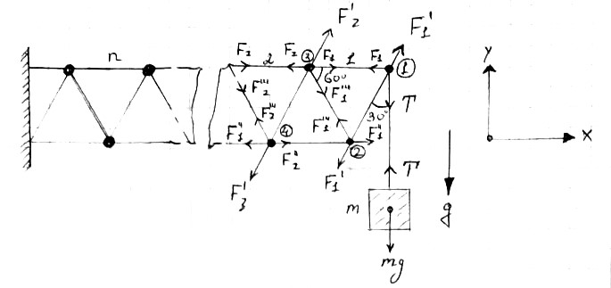

###  Условие

$2.8.25^*.$ К системе из одинаковых стержней, соединенных шарнирами, подвешен груз массы $m$, как показано на рисунке. Определите силу, растягивающую $n$-й верхний горизонтальный стержень

### Решение

  Силы действующие на систему

Рассмотрим силы, действующие на 1-й стержень.

$$
\left\\{\begin{matrix} F_1=F_1'\cos(60^{\circ})=F_1'/2 \\\ T=F_1'\cos(30^{\circ})=\sqrt{3}F_1'/2 \end{matrix}\right.
$$

$$
\left\\{\begin{matrix} F_1'''\cos(30^{\circ})=F_1'\cos(30^{\circ}) \\\ F_1'=F_1'''\\\ F_1'''\cos(60^{\circ})+F_1'\cos(60^{\circ})=F_1'' \\\ F_1'=F_1''\\\ \end{matrix}\right.
$$

Аналогично для второго стержня

$$
\left\\{\begin{matrix} F_2''\cos(30^{\circ})=F_1'''\cos(30^{\circ}) \\\ F_2'=F_1'''=F_1'\\\ F_2=F_2'\cos(60^{\circ})+F_1+F_1'''\cos(60^{\circ})\\\ F_2=3F_1'/2 \end{matrix}\right.
$$

$$
F_1'=\frac{2T}{\sqrt{3}}=\frac{2mg}{\sqrt{3}}
$$

$$
\boxed{F_1=\frac{mg}{\sqrt{3}} \to F_2=\frac{3mg}{\sqrt{3}}}
$$

Как мы видим, индекс при $F_2$ увеличился на два, что приводит к рекуррентному соотношению для индекса $n$-го стержня: $2n-1$

$$
\boxed{F_n=\frac{(2n-1)mg}{\sqrt{3}}}
$$

#### Ответ

$$
T_n=(2n-1)mg/\sqrt{3}
$$