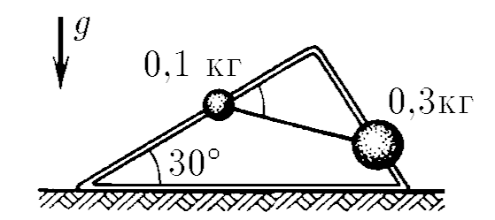

###  Условие: 

$2.8.6.$ Из проволоки изготовлена рама в форме прямоугольного треугольника, которая помещена в вертикальной плоскости так, как показано на рисунке. По проволоке могут скользить без трения связанные нитью грузы массы $m_1 = 0.1 \,кг$ и $m_2 = 0.3 \,кг$. Найдите силу натяжения нити и угол между нитью и длинным катетом треугольника при равновесии. 

###  Решение: 

  Силы действующие на систему 

Условие равновесия: $$m_1\vec{g} + \vec{T}_1 +\vec{N}_1=0$$ $$m_2\vec{g} + \vec{T}_2 +\vec{N}_2=0$$ Из третьего закона Ньютона $$T_1=T_2=T$$ Проектируем на оси перпендикулярный $\vec{N}_1$ и $\vec{N}_2$, соответственно $$m_1g \sin\alpha = T_1 \cos\beta$$ $$m_2g \cos\alpha = T_2 \sin\beta$$ Делим второе уравнение на первое $$\boxed{\tan\beta = \frac{m_2}{m_1} \frac{1}{ \tan\alpha}}$$ Находим $T$ $$T = m_1g \frac{ \sin\alpha}{\cos\beta}$$ Подставляем выражение для угла $\beta$ $$\boxed{T = g\sqrt{(m_1 \sin\alpha )^2+(m_2 \cos\alpha )^2}}$$ 

###  Альтернативное решение: 

 

####  Ответ: $T \approx 2.6 \,Н;~\alpha = \arctan(3\sqrt{3})$

  

