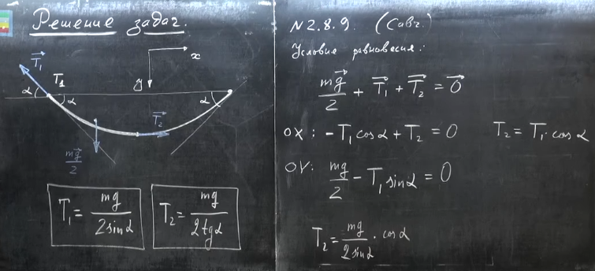
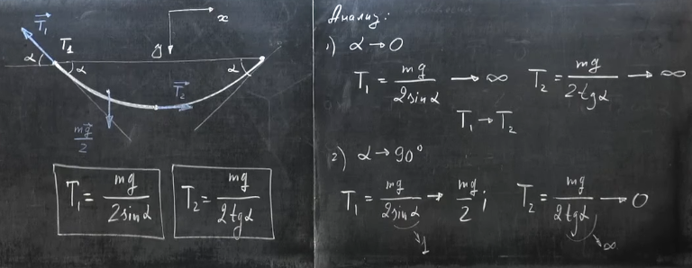

###  Условие:

$2.8.9.$ Цепочка массы $m$ подвешена за концы так, что вблизи точек подвеса она образует с горизонталью угол $\alpha$. Определите силу натяжения цепочки в ее нижней точке и в точках подвеса.

###  Решение:

#### Ответ: $T = mg/(2 \tan\alpha )$; $\,\,{T}' = mg/(2 /\sin\alpha )$