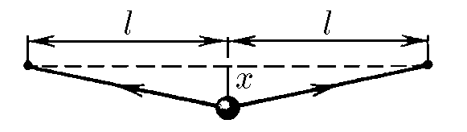

###  Условие 

$3.1.1.$ Посередине натянутой струны длины $2l$ закреплен шар. Какая суммарная сила действует на шар со стороны струны, если поперечное смещение его из положения равновесия $x \ll l$, а сила натяжения струны $F$ не зависит от смещения? Почему при малых смещениях можно считать зависимость силы, действующей на шар, от $x$ линейной? Как направлена эта сила по отношению к смещению? Найдите, как зависит потенциальная энергия шара от малого смещения $x$. Какова скорость шара при прохождении им положения равновесия, если его максимальное смещение равно $x_0$? Масса шара $m$. 

### Решение

Помимо силы тяжести $mg$ на шар действуетсила натяжения струны $F$, которая имеет вертикальную компоненту $F'$: $$F'=-2F\cos\alpha =-2F\frac{x}{\sqrt{l^2+x^2}}\quad(1)$$ Т.к. колебания малые, учтем, что $x\ll l$ $$\frac{x}{\sqrt{l^2+x^2}} = \frac{1}{\sqrt{1+\frac{l^2}{x^2}}}$$ Т.к. $x\ll l$, то $\frac{l^2}{x^2} \gg 1$: $$\frac{1}{\sqrt{1+\frac{l^2}{x^2}}}=\frac{1}{\sqrt{\frac{l^2}{x^2}}}=\frac{x}{l}$$ Подставляя в $(1)$ $$\boxed{F'=-2F\frac{x}{l}}$$ Найдём малое изменение энергии как $$dU=2F\cos\alpha dx=2F\sqrt{\frac{x}{l^2+x^2}}=2F\frac{x}{l}dx$$ Далее, проинтегрируем $dU$ от $0$ до $U$ $$U=\int_{0}^{U}dU=\int_{0}^{x}2F\frac{x}{l}dx=\boxed{\frac{Fx^2}{l}}$$ Из закона сохранения энергии, получаем искомую скорость при максимальном смещении $$\frac{Fx_0^2}{l}=\frac{m\upsilon^2}{2}\Rightarrow \boxed{\upsilon =x_0\sqrt{\frac{2F}{ml}}}$$ 

#### Ответ

$$\upsilon =x_0\sqrt{\frac{2F}{ml}}$$ 
