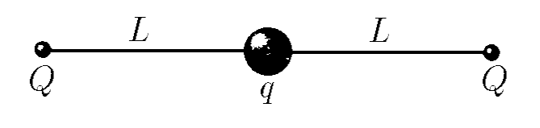

###  Условие 

$3.1.10^*.$ Бусинка с зарядом $q$ может двигаться без трения по натянутой нити длины $2L$, на концах которой закреплены заряды $Q$. Найдите приращение потенциальной энергии при смещении бусинки на $x$ вдоль нити из ее центра. Убедитесь, что при малых смещениях зависимость приращения потенциальной энергии от $x$ квадратичная. Найдите, на сколько сместится бусинка массы $m$, если в положении равновесия ей сообщат небольшую скорость $v$. 

### Решение

Начальная энергия электрического поля $$U_1=\frac{2kQq}{L}$$ Энергия системы после смещения бусины $$U_2=\frac{kQq}{L-x}+\frac{kQq}{L+x}$$ Изменение энергии системы $$\Delta U=U_2-U_1=kQq\left(\frac{1}{L-x}+\frac{1}{L+x}-\frac{2}{L}\right)$$ Рассмотрим преобразование для малых значений $(1+\xi )^\alpha =1+\alpha\xi$, где $\xi\ll1$ $$\boxed{\Delta U \approx\frac{Qqx^2}{2\pi\varepsilon_0L^3}}$$ Из принципа сохранения энергии следует, что кинетическая энергия будет равна изменению электрической энергии $\Delta U$ $$E_k=\Delta U\Leftrightarrow \frac{m\upsilon^2}{2}=\frac{Qq\Delta x^2}{2\pi\varepsilon_0L^3}$$ Откуда мы находим изменение длины $\Delta x$ $$\boxed{\Delta x=\upsilon\sqrt{\frac{m\pi\varepsilon_0L^3}{Qq}}}$$ 

#### Ответ

$$\Delta U=\frac{Qqx^2}{2\pi\varepsilon_0L^3};\quad\Delta x=\upsilon\sqrt{\frac{m\pi\varepsilon_0L^3}{Qq}}$$ 
