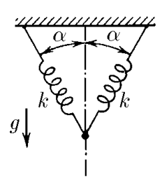

###  Условие

$3.1.11.$ Две пружины жесткости $k$, соединенные, как показано на рисунке, не деформированы. Какой массы груз следует подвесить к точке соединения пружин, чтобы он опустился на малое расстояние $x$ в положение равновесия?

### Решение

Каждая пружина будет иметь силу упругости при растяжении

$$
F_y=k\Delta l=kx\cos\alpha
$$

Условие равенства сил

$$
mg=2F_y\cos\alpha =2kx\cos^2 \alpha
$$

Откуда, масса груза

$$
\boxed{m=\frac{2kx\cos^2 \alpha}{g}}
$$

#### Ответ

$$
m=\frac{2kx\cos^2 \alpha}{g}
$$