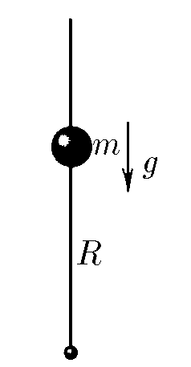

###  Условие 

$3.1.12.$ а. Небольшое заряженное тело массы $m$ может скользить по вертикальной спице, в нижней точке которой закреплен заряд, одноименный с зарядом тела. Положение равновесия тела находится на расстоянии $R$ от этого заряда. Как зависит сила, действующая на тело, от малого его смещения $x$ из положения равновесия? б. Массу тела увеличили втрое, оставив заряды неизменными. На каком теперь расстоянии от нижнего конца спицы находится положение равновесия тела? Как зависит сила, действующая на тело, от малого его смещения из положения равновесия? 

### Решение

a) Равенство сил в положении равновесия $$mg=\frac{kq^2}{R^2}\Rightarrow kq^2=mgR^2$$ $$F'=F-mg=\frac{mgR^2}{R^2+2Rx+x^2}-mg$$ $$F'=\frac{mgR^2-mgR^2-2mgRx-mgx^2}{(R+x)^2}$$ Пользуясь приближением для $x\ll R$ $$F'\approx-\frac{2mgRx}{(R+x)^2}$$ Далее воспользумся приближения: $(1+x)^\alpha$$\approx1+\alpha x$, где $x\ll1$ $$F'=-\frac{2mgRx}{(R+x)^2}\approx-2mgRx\frac{1}{R^2}(1-2\frac{x}{R})$$ $$F'=-\frac{2mgx}{R}-\frac{4mgx^2}{R^2}$$ Учитывая $x \ll R$, мы пренебрегаем слагаемым с $R^2$ $$\boxed{F'\approx-\frac{2mgx}{R}}$$ б) Далее запишем систему уравнений равновесия системы $$\left\\{\begin{matrix}3mg=\frac{kq^2}{x^2} \\\ mg=\frac{kq^2}{R^2} \end{matrix}\right.$$ Найдём теперь на каком расстоянии от нижнего конца спицы находится положение равновесия тела $$\frac{R}{x}=\sqrt{3}\Rightarrow \boxed{x=\frac{R}{\sqrt{3}}}$$ Сила, действующая на тело зависит от малого его смещения из положения равновесия $$\boxed{F''=-\frac{2m'gx}{R'}=-\frac{6mgx}{R'}}$$ 

#### Ответ

$$F=-\frac{2mgx}{R};\quad R'=\frac{R}{\sqrt{3}};\quad F'=-\frac{6mgx}{R'}$$ 
