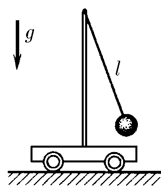

###  Условие 

$3.1.15.$ Амплитуда малых колебаний математического маятника, стоящего на тележке, равна $x_0$, а амплитуда колебаний тележки $y_0$. Длина нити маятника $l$. Определите максимальную скорость маятника и тележки. Трением пренебречь. 

### Решение

Закон сохранения энергии $$\frac{mg(x_0+y_0)^2}{2l}=\frac{m\upsilon^2}{2}+\frac{MU^2}{2}$$ Закон сохранения импульса $$m\upsilon =MU$$ Т.к. центр масс не изменяет положение $$mx_0=My_0$$ Решим верхнее уравнение относительно $\upsilon$: $$\upsilon =\sqrt{\frac{Mg}{(M+m)l}(x_0+y_0)^2}=\sqrt{\frac{x_0g}{(x_0+y_0)l}(x_0+y_0)^2}$$ Максимальную скорость маятника $$\boxed{v=x_0\sqrt{\frac{g}{l}(1+\frac{y_0}{x_0})}}$$ Решим верхнее уравнение относительно $U$: $$U=\sqrt{\frac{mg}{(M+m)l}(x_0+y_0)^2}=\sqrt{\frac{y_0g}{(x_0+y_0)l}(x_0+y_0)^2}$$ Максимальную скорость тележки $$\boxed{U=y_0\sqrt{\frac{g}{l}(1+\frac{x_0}{y_0})}}$$ 

#### Ответ

$$\upsilon =x_0\sqrt{\frac{g}{l}(1+\frac{y_0}{x_0}});\quad U=y_0\sqrt{\frac{g}{l}(1+\frac{x_0}{y_0})}$$ 
