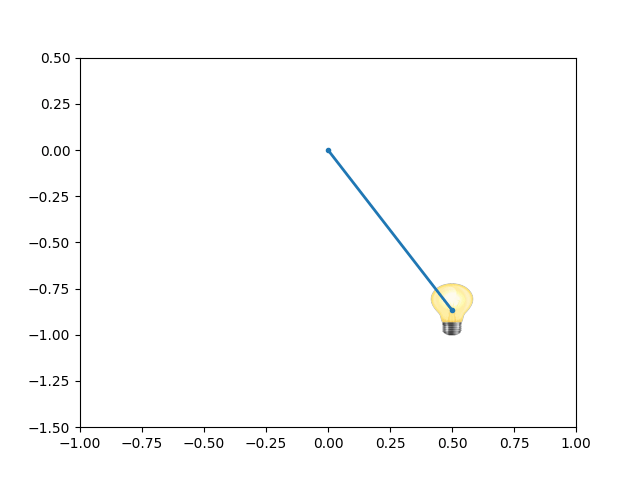

###  Условие 

$3.1.4.$ Почему кажется, что быстро колеблющаяся на пружине лампочка вспыхивает в крайних точках своей траектории? 

### Решение

Мощность лампочки, а как следствие интенсивность лампочки остаётся постоянной, таким образом чем больше лампочка находится в определенном моменте, тем больше энергии приходит глазу. Т.к. человеческий глаз воспринимает накапливает энрегию света при особо большой частоте изменения(более подробно: [doi.org/10.1016/S0042-6989(99)00084-X](https://doi.org/10.1016/S0042-6989\(99\)00084-X)), то чем больше тело находится в определённой точке, тем более ярким оно кажется для сетчатки нашего глаза

Воспринимаемая энергия обратно пропорционально времени нахождения в данном месте: $$W\sim\Delta t$$ При гармоническом движении, положение лампочки описывается выражением $$x(t) = x_0 \sin\omega t$$ Отсюда, значение скорости меняется как $$v(t) = \dot{x}(t) =\omega\cdot x_0\cos\omega t$$ Чем меньше скорость, тем больше времени необходимо лампочке на преодоление равных промежутков времени $$v\sim\frac{1}{\Delta t}$$ Таким, образом когда скорость лампочки при гармоническом движении является минимальной, то энергия воспринимаемая глазом становится больше $$W\sim \frac{1}{v}$$ Таким, образом лампочка кажется ярче в местах, где её скорость минимальна, т.е. в своих крайних точках 
