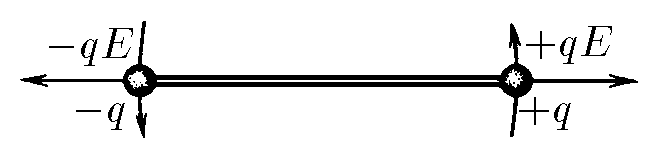

###  Условие 

$3.1.8^*.$ Два одинаковых шарика с зарядами $\pm q$, жестко связанные невесомым стержнем длины $l$, находятся в электрическом поле, которое действует на них с силой $\pm qE$. Определите массу шарика, если амплитуда малых поперечных колебаний шариков равна $x_0$, а максимальная скорость шариков $v_0$. 

### Решение

Второй закон ньютона для нормальной силы кулона, которая создаёт возвращающий момент силы, найдем в проекции на вертикальную ось $$ma_\tau =-qE\sin\varphi$$ Т.к. угол $\varphi$ пренебрежимо маленький, то воспользуемся $\sin\varphi\approx\varphi$ $$-qE\varphi=-qE\frac{2x}{l}$$ Откуда получаем уравнение гармонических колебаний $$m\ddot{x}(t)+\frac{2qE}{l}x(t)=0$$ $$\ddot{x}(t)+\frac{2qE}{ml}x(t)=0$$ Решение которого нам известно: $$\omega =\sqrt{\frac{2qE}{ml}}$$ Откуда, аналогично [3.1.6](../3.1.6), находим максимальную скорость $$\upsilon_0=x_0\omega =x_0\sqrt{\frac{2qE}{ml}}$$ После математических преобразований получаем массу шарика $$\boxed{m=\frac{2qEx_0^2}{l\upsilon_0^2}}$$ 

#### Ответ

$$m=\frac{2qEx_0^2}{l\upsilon_0^2}$$ 
