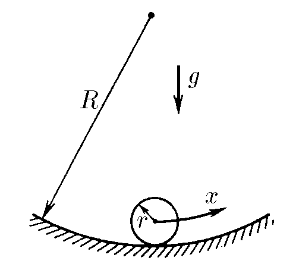

###  Условие

$3.1.9.$ Шарик массы $m$ и радиуса $r$ скользит по поверхности лунки, радиус кривизны которой $R$. Найдите зависимость потенциальной энергии шарика от малого смещения $x$ из положения равновесия.

### Решение

Также как и в [3.1.5](../3.1.5), предложим два варианта решения: через малые преращения и через интегрирование

При отклонении тела по горизонтали на малую величину $x$, его высота изменяется на величину

$$
h=R'-\sqrt{{R'}^2-x^2}=R'\left(1-\sqrt{1-\frac{x^2}{{R'}^2}}\right)\tag{1}
$$

Где $R'$ — расстояние от центра кривизны до центра масс шарика

$$
R'=R-r
$$

Учитывая, малость $x$

$$
x\ll R'\Leftrightarrow \frac{x}{R'}\ll 1
$$

Так мы можем воспользоваться approximation $(1+\xi )^a\approx 1+\xi a$, где $\xi\ll 1$

$$
\left(1-\frac{x^2}{{R'}^2}\right)^{1/2}=1-\frac{x^2}{2{R'}^2}
$$

Подставляем в $(1)$

$$
h=R'\cdot \frac{x^2}{2{R'}^2}=\frac{x^2}{2R'}
$$

Подставляем в формулу для потенциальной энергии

$$
U=mgh=mg\frac{x^2}{2R'}
$$

Подставляя значение для $R'$, получаем финальное выражение

$$
\boxed{U=\frac{mgx^2}{2(R-r)}}
$$

### Альтернативное решение

Именение энергии при малом изменении координаты можно найти по определению

$$
dU=Fdx
$$

При этом горизонатльная сила, которая будет возвращать шарик в устойчивое равновесие найдём с учётом малости угла $\varphi$

$$
F=mg\sin\varphi=mg\frac{x}{R-r}
$$

Откуда потенциальную энергию найдём через интегрирование $dU$

$$
U=\int_{0}^{U}dU=\int_{0}^{x}mg\frac{x}{R-r}dx=\frac{mg}{R-r}\int_{0}^{x}xdx
$$

Данный интеграл решается как

$$
\int_{0}^{x}xdx=\frac{mg}{R-r}\cdot\frac{x^2}{2}
$$

Откуда потенциальная энергия шарика

$$
\boxed{U=\frac{mgx^2}{2(R-r)}}
$$

#### Ответ

$$
U=\frac{mgx^2}{2(R-r)}
$$